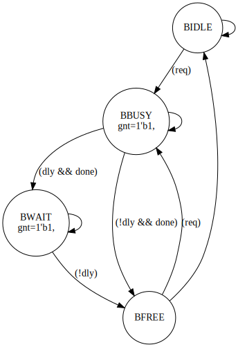

fsm2sv
======

Introduction
------------

`fsm2sv` is a tool that generates a synthesizable SystemVerilog (SV)
implementation of a Finite State Machine (FSM) specification.
The FSM specification is written as a YAML file. In addition to the SV
implementation, it can also generate:

  - A **visualization** of the FSM using [Graphviz dot](https://graphviz.org/)
    format.
  - A **Verilog testbench** for simulation with [Icarus verilog](https://github.com/steveicarus/iverilog)
  - A **SystemC testbench** using [Verilator](https://verilator.org/)
    to test the generated FSM.

The YAML description aims to:

  1. **Be compact and easy-to-read**: The user should be able to understand
  the FSM behavior from the YAML spec and modify it easily.
  On average, the YAML spec is ~3x smaller in size than the FSM
  implementation.
  2. **Generate efficient RTL**: The SV code is generated acccording to
     best-practices and enables the user to choose between implementing the
     FSM states using either *counter* or *onehot* encodings.
     In addition, the code is generated to be free of warnings and pass linter
     checks.


Requirements
------------

`fsm2sv` is written using Python 3. It is tested using Python 3.8 and 3.10.
All the used modules are part of Python's standard library except for `yaml`.
If it is not present on your system, you can install it as follows:

  ```
  pip install pyyaml
  ```

In addition to Python, the following tools are needed:

  - [Verilator](https://verilator.org/): Used to perform linter checks.
    Tested with version 4.214
  - [Icarus Verilog](https://github.com/steveicarus/iverilog): Used to simulate
    the generated Verilog testbench. Tested with version 11.0.
  - [SystemC](https://accellera.org/downloads/standards/systemc): Used to run
    the SystemC testbench of the verilated model. Tested with version 2.3.3.
  - [Graphviz dot](https://graphviz.org/): Used to generate the FSM
    visualization
  - [flake8](https://flake8.pycqa.org/en/latest/) and [pylint](https://pylint.org/):
    Used to lint `fsm2sv` sources.


YAML Specification
------------------

The YAML consists of four maps and three scalars.
The maps are:

  - `reset`: defines the properties of the reset signal such as polarity
    (i.e., active low or active high) and whether it is asynchronous or not.
    The `reset` map is defined as follows:

    ```
    reset:
      - active_low: false | true
      - asynchronous: false | true
    ```

  - `inputs`: defines the inputs to the FSM. For each input, we define
    its name and width. The `inputs` map is defined as follows:

    ```
    inputs:
      - input1_name:
        width: N1
      - input2_name:
        width: N2
      ...
    ```

    where `input1_name`, `N1`, etc. are to be replaced with the actual
    input name and width in bits.

  - `outputs`: defines the outputs of the FSM. For each output, we define
    its name, width, and whether it is a registered output (i.e., driven
    from flip-flops) or not. The `outputs` map is defined as follows:

    ```
    outputs:
      - output1_name:
        width: N1
        reg: false | true
      ...
    ```

    where `output1_name` and `N1` are to be replaced with the actual
    output name and width in bits. `reg` defines whether the output is driven
    from a register or not.

  - `transitions`: defines the states and the transition conditions between
    them. The `transitions` map is defined as follows:

    ```
    - state1_name:
      - (condition_0), next_state_0, <mealy_outputs>
      - (condition_1), next_state_1
      - ...
      - next_state
      - <moore_outputs>
    ```

    `state1_name` is the state name and it defines an underlying map that
    consists of one or more tuples.
    Each tuple is a comma-separated list and takes one of the following forms:

    ```
    - (condition), next_state, <mealy_outputs>
    - (condition), next_state
    - next_state
    - <moore_outputs>
    ```

    The round brackets `()` enclose the input condition.
    The round brackets must contain a valid SV expression that evaluates
    to either Boolean true or false. During the FSM generation, the
    round brackets together with their content will be inserted into SV
    `if/else if/else` conditions.
    The `next_state` is the name of the next state of the FSM when the
    transition condition is true.
    Finally, if `<mealy_outputs>` is present, then the angle brackets contain
    a semicolon separated list of output assignments that look as follows:

    ```
    <out1 = 0; out2 = 2'b10; out3 = 4'hf>
    ```

    These assignments must be a valid SV expression that can be inserted as an
    SV statement inside an `always_comb` process.
    In addition to input-triggered transitions, the FSM can move to
    another state in the next clock cycle. This can be done by specifying
    `next_state` without a trigger condition.
    Finally, each state can define a list of Moore's outputs in a fashion
    similar to the Mealy's outputs:

    ```
    <out1 = 0; out2 = 2'b10; out3 = 4'hf>
    ```

The scalars in the YAML specification are:

  - `name`: A string that defines the FSM name. Used to name the SV module
    and the file.
  - `initial_state`: A string that defines the name of the initial state.
    It must contain a state name that is defined in the `transitions` map.
  - `encoding`: A string that defines the encoding scheme of the states.
    At the moment, it can be either
    `counter` or `onehot`


### Coding Style

`fsm2sv` enforces an efficient coding style according to the
style defined in [Synthesizable Finite State Machine Design Techniques
Using the New SystemVerilog 3.0 Enhancements](http://www.sunburst-design.com/papers/CummingsSNUG1999SJ_fsm_perl.pdf)
by Cliff Cummings.
The generated FSM contains two processes:

  1. A sequential process implemented using `always_ff` that realizes the
     state flip-flops and registered outputs.
  2. A combinational process that defines the next state and implemented using
     `always_comb`

All sequential signals have a `_q` suffix while their flip-flop inputs have a
`_d` suffix.
The transitions are translated into a `unique case` block where for each
state the transitions are defined using an `if/else if/else` block as
follows:

```
  - BBUSY:
    - (dly && done), BWAIT
    - BBUSY
    - (!dly && done), BFREE
    - <gnt = 1'b1>
```

becomes:

```
  # By default, FSM remains in the current one
  state_d = state_q;
  unique case (state_q)
    BBUSY: begin
      gnt = 1'b1;
      if (!dly && done) begin
        state_d = BFREE;
      end else if (dly && done) begin
        state_d = BWAIT;
      end else begin
        state_d = BBUSY;
      end
    end
    ...
  endcase
```


### Example FSM

An example YAML specification looks as follows:

```
---
name: example1       # FSM name

reset:               # reset signal map
  asynchronous: true
  active_low: true

inputs:              # inputs map
  - req:             # input signal name
      width: 1       # width of the input signal
  - dly:
      width: 1
  - done:
      width: 1

outputs:
  - gnt:             # output signal name
      width: 1       # signal width
      reg: false     # combinational output

transitions:         # transitions map
  - BIDLE:           # state name
    - (req), BBUSY   # if (req) move to state BBUSY
    - BIDLE          # if no triggers occur, move to BIDLE
  - BBUSY:
    - (dly && done), BWAIT
    - BBUSY
    - (!dly && done), BFREE
    - <gnt = 1'b1>
  - BWAIT:
    - (!dly), BFREE
    - BWAIT
    - <gnt = 1'b1>
  - BFREE:
    - BIDLE
    - (req), BBUSY
initial_state: BIDLE  # Initial state
encoding: onehot # or "counter"
```

The complete YAML specification is available under `examples/example1.yml`.
The resulting FSM looks as follows:



The generated RTL looks as follows:

```
module example1 (
  // inputs
  input  logic [0:0]   dly,
  input  logic [0:0]   done,
  input  logic [0:0]   req,
  // outputs
  output logic [0:0]   gnt,
  // clock and reset
  input  logic         clk_i,
  input  logic         rst_ni
);

`ifdef USE_ENUM_STATE
  typedef enum logic [3:0] {
    BIDLE = 4'd1,
    BBUSY = 4'd2,
    BWAIT = 4'd4,
    BFREE = 4'd8
  } state_t;
`else
  localparam logic [3:0] BIDLE = 4'd1;
  localparam logic [3:0] BBUSY = 4'd2;
  localparam logic [3:0] BWAIT = 4'd4;
  localparam logic [3:0] BFREE = 4'd8;
  typedef logic [3:0] state_t;
`endif  // USE_ENUM_STATE

  state_t state_d, state_q;


  always_ff @(posedge clk_i, negedge rst_ni) begin
`ifdef FORMAL
    // TODO: Add SV assertions here
`endif  // FORMAL
    if (!rst_ni) begin
      state_q <= BIDLE;
    end else begin
      state_q <= state_d;
    end
  end

  always_comb begin
    // default values
    state_d = state_q;
    gnt = '0;
    unique case (state_q)
      BIDLE: begin
        if (req) begin
          state_d = BBUSY;
        end else begin
          state_d = BIDLE;
        end
      end
      BBUSY: begin
        gnt = 1'b1;
        if (!dly && done) begin
          state_d = BFREE;
        end else if (dly && done) begin
          state_d = BWAIT;
        end else begin
          state_d = BBUSY;
        end
      end
      BWAIT: begin
        gnt = 1'b1;
        if (!dly) begin
          state_d = BFREE;
        end else begin
          state_d = BWAIT;
        end
      end
      BFREE: begin
        if (req) begin
          state_d = BBUSY;
        end else begin
          state_d = BIDLE;
        end
      end
      default: begin
        state_d = BIDLE;
      end
    endcase
  end
endmodule
```

More examples are available under `examples`.


Checks/Assertions
-----------------

The tool does two types of checks: (1) generation-time checks, and
(2) simulation-time checks.
The generation-time checks are done on the YAML specification, while the
simulation-time checks are done on the generated SV code.
Currently, the tool implements the following generation-time checks:

  - Ensure that `next_state` values are defined in the `transitions`
    dict
  - Number of states is greater than one
  - Number of outputs is greater than zero
  - `initial_state` is defined in `transitions`


TODO/Next Steps
---------------

  1. Add SV assertions
  2. Parse the input/output statements to check input/output names and verify
     that values match the ports' widths.


LICENSE
-------
This tool is licensed under the BSD license shown in [LICENSE](LICENSE).


Suggestions/Issues
------------------

If you have any suggestions/issues, please open an issue or a pull request.
